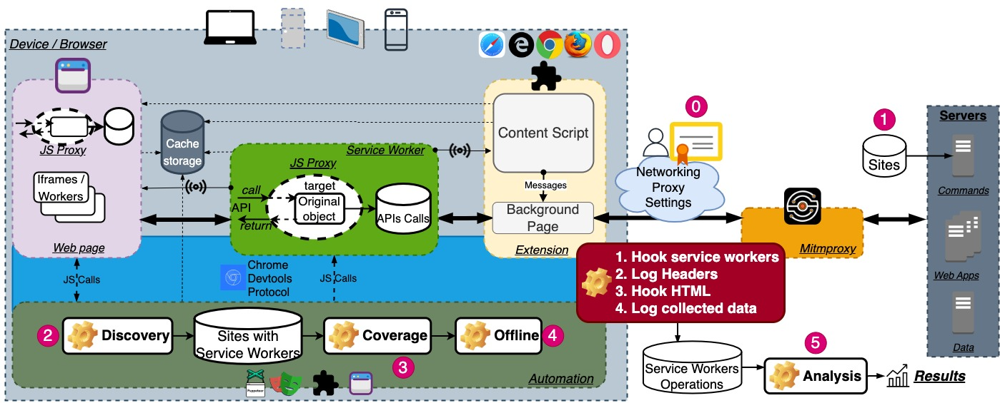
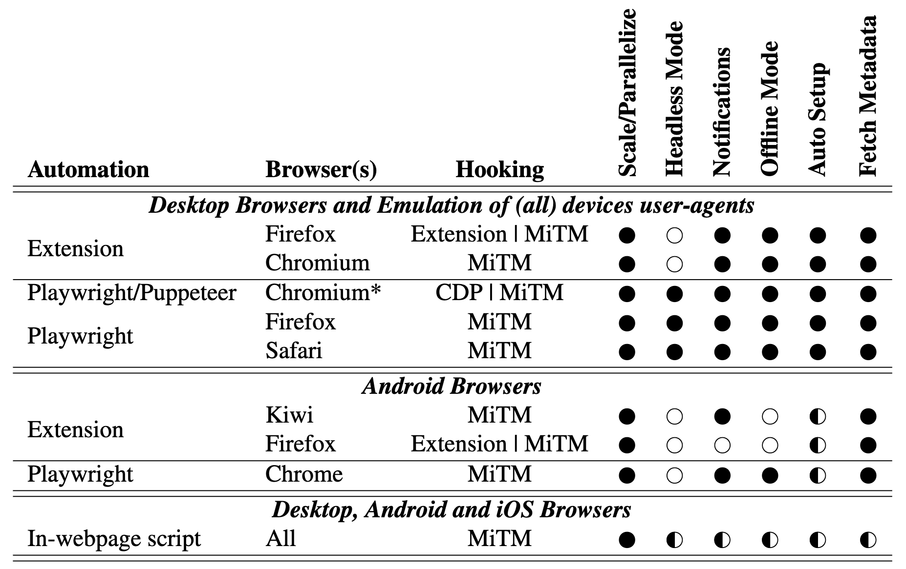

# ProwseBox

## Architecture

Architecture, components and setup of ProwseBox, the scalable service workers (SWs) and Progressive Web Applications (PWAs) analysis tool which supports push notifications, offline analysis, etc. Data collected can support web apps security, privacy or debugging analyses purposes. ProwseBox supports both real and emulated mobile and desktop browsers and devices, on all sorts of operating systems. Analysis can be done on a single device, or easily distributed among multiple machines. In most cases, the analysis is fully automated. For some mobile devices/browsers, editing trusted certificate authorities and network proxy settings require user manual interaction.

## Setups

ProwseBox: Supported browsers and platforms and features. Desktop browsers automated by an extension or CDP (Chrome Devtools Protocol) via frameworks such as Puppeteer or Playwright, provide the most complete features set and can further emulate (all)most any other browser provided its user-agent string. Browser extensions require headfull browsers, and mobile platforms all require at least some manual setup. The in-webpage automation combined with MiTM (Man-in-the-middle HTTPS Proxy) for SWs hooking was primarily designed to support iOS browsers, but this setup is browser-agnostic and therefore supports other browsers and OSes as well
